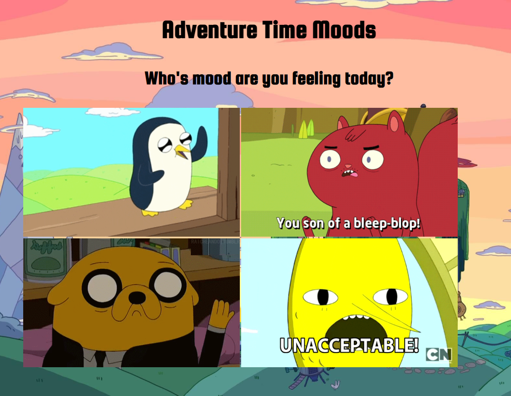

# Adventure Time Express

I created an Application including Adventure Time gifs asking the user which gif would best describe the feeling they have. When thr user chooses which gif they are best feeling the user will be prompted to a new page displaying a bunch of images from the show that are particularly humorous. I am deploying the server with the use of Express in Node.js.
&emsp;

## How Its Made 
**Languages used:** Html, CSS, Javascript, Node.js  , Express
# What I Learned
I learned how Node.js works and how Express helps in making the process of serving up any files by targeting the folder it is in.
### My Other Projects 
Check out some of my other work using the DOM!
* [JDM Express](https://github.com/BrianMelaraDev/jdmPersonalExpress/blob/main/README.md)
* [Node Palindrome](https://github.com/BrianMelaraDev/node-palindrome-bootcamp/tree/answer)
